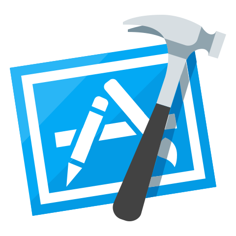

 <h2 align="center">Hi there 👋, I'm Dhirendra!</h2>

I am a highly motivated Senior Software Engineer with over 8 years of experience in iOS app development, contributing to the success of more than 25+ applications. Proficient in Swift, SwiftUI and Objective-C, I specialize in designing, building, and maintaining native iOS apps.

My technical expertise includes backend API integration, Socket API implementation, Google Map SDK, Core Data, Realm, version control, social authentication, CocoaPods, real-time video, image rendering, and payment gateway integration.

In the last 1 year, I have expanded my skill set to include frontend development using JavaScript(React.js). This additional experience has allowed me to create seamless user interfaces and integrate frontend technologies with backend systems. Skilled in FrontEnd Technologies✍️ as React.js, Redux, EcmaScript, JavaScript, HTML, CSS, Bootstrap, and Flexbox for building professional websites🖥 and front-end applications 💻.

I am dedicated to delivering high-quality code, prioritizing clean and maintainable solutions. My adaptability to new technologies and commitment to staying current with industry trends make me a versatile software engineer ready to contribute to your projects.

Responsibilities-
- Developing new user-facing features
- Building reusable components for future use
- Translating designs into high quality code
- Optimizing performance of the application
- Optimizing App Size
- Team Handling
- Fetaure Handling
- Troubleshooting the bugs
 
Skills-
Strong proficiency in Swift, JavaScript, SwiftUI and Objective C
Familiarity with RESTful APIs
Ability to understand business requirements and translate them into technical requirements
Familiarity with common tools such as Git, Bitbucket, JIRA, Sketch, Figma.

### Frontend Technologies

  
  
  
  
  
  
  
  
  
  
  

 

### Tools

  
  
  
  
  
   

  
🙋‍♂️ 𝗖𝗼𝗻𝘁𝗮𝗰𝘁 𝗺𝗲:

LinkedIn - https://www.linkedin.com/in/dhirendra-verma-5b3a32146/   
GitHub - https://github.com/Dhiru201  
Leetcode - https://leetcode.com/priya42bagde/  
Portfolio - For portfolio connect with me.   

--------

&nbsp;

     

&nbsp;Git profile Trophies
 

  

<!--
JavaScriptCodingInterviewQuestions&show_owner=true)](https://github.com/priya42bagde/repo-name)

-->
